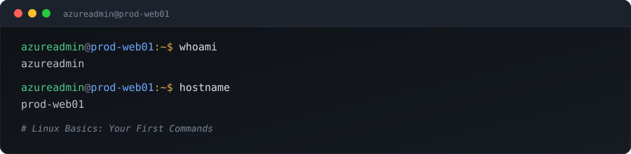

<div align="center">



<br/>


</div>

<br/>

# Linux Basics: Your First Commands

> A hands-on guide to the Linux shell — every command explained with a real production scenario, so you understand not just **what** to type, but **why**.

<br/>

## 📁 `ls -la ./chapters`

| # | Chapter |
|---|---------|
| 01 | [Introduction to the Linux Shell](#-ch01--introduction-to-the-linux-shell) |
| 02 | [Your First Linux Commands](#-ch02--your-first-linux-commands) |
| 03 | [Command Flags](#-ch03--command-flags) |
| 04 | [Keyboard Shortcuts](#-ch04--keyboard-shortcuts) |
| 05 | [`pwd` — Print Working Directory](#-ch05--pwd--print-working-directory) |
| 06 | [`ls` — List Files and Folders](#-ch06--ls--list-files-and-folders) |
| 07 | [`cat` — Display File Contents](#-ch07--cat--display-file-contents) |
| 08 | [Tab Completion](#-ch08--tab-completion) |
| 09 | [`mkdir` — Create Directories](#-ch09--mkdir--create-directories) |
| 10 | [`cd` — Change Directories](#-ch10--cd--change-directories) |
| 11 | [Redirecting Output (`>`)](#-ch11--redirecting-output-) |
| — | [Summary Table](#-summary) |

---

## 🟢 CH.01 — Introduction to the Linux Shell

When you open a Linux terminal, you interact with a program called the **Shell**. On Ubuntu, the default shell is **Bash** (Bourne Again Shell).

Think of the shell as your personal assistant: you type commands, the shell understands them, and the operating system performs the requested task.

**Anatomy of a prompt:**

```console
root@abc123:~#
```

| Part | Meaning |
|------|---------|
| `root` | Current logged-in user |
| `abc123` | Computer hostname |
| `~` | Current directory (Home folder) |
| `#` | Root user prompt |

A normal user's prompt uses `$` instead of `#`:

```console
sourabh@devserver:~$
```

> 🎬 **Live scenario**
> You're a DevOps Engineer connecting to an Azure Virtual Machine. You see `azureadmin@prod-web01:~$` and instantly know: logged-in user is `azureadmin`, machine is `prod-web01`, you're in the home folder, and you're a normal user — not root.

---

## 🟢 CH.02 — Your First Linux Commands

These commands are completely safe — they only display information.

### 1. `whoami` — shows the current user

```console
$ whoami
root
```

> 🎬 **Real world** — You SSH into a production server. Before deleting anything, verify who you are. If it shows `devuser` instead of `root`, you can't perform administrative tasks.

### 2. `hostname` — shows the machine's name

```console
$ hostname
db01
```

> 🎬 **Live scenario** — Your company runs `web01`, `web02`, `db01`, `db02`, `backup01`. Before restarting a service, run `hostname` to confirm you're on the database server, not the web server.

### 3. `date` — shows current date and time

```console
$ date
Tue Jul 28 10:15:20 UTC 2026
```

> 🎬 **Live scenario** — An app stopped working at 10:00 AM. If `date` shows a mismatched time like 8:01 AM, the server clock is wrong — which can break logs, certificates, and scheduled tasks.

### 4. `uname -a` — kernel and system info

```console
$ uname -a
Linux prod-web01 6.8.0 x86_64 GNU/Linux
```

| Part | Description |
|------|-------------|
| `Linux` | Kernel name |
| `prod-web01` | Hostname |
| `6.8.0` | Kernel version |
| `x86_64` | Architecture |
| `GNU/Linux` | Operating system |

> 🎬 **Live scenario** — A vendor asks if your server is 32-bit or 64-bit. Running `uname -a` and seeing `x86_64` confirms it's 64-bit.

### 5. `echo` — prints text

```console
$ echo "Deployment Started"
Deployment Started
```

> 🎬 **Live scenario** — Before writing a shell script, test a message with `echo` to confirm your syntax works.

---

## 🟢 CH.03 — Command Flags

Flags change the behavior of a command.

```console
$ uname
Linux

$ uname -s        # explicit form
Linux

$ uname -a        # detailed info
Linux prod-web01 6.8.0 x86_64 GNU/Linux
```

> 🎬 **Live scenario** — During troubleshooting, support asks only for the kernel name. Use `uname -s` instead of `uname -a` since they only need `Linux`.

---

## 🟢 CH.04 — Keyboard Shortcuts

| Shortcut | Action |
|----------|--------|
| <kbd>Ctrl</kbd> + <kbd>C</kbd> | Stops a running command |
| <kbd>Ctrl</kbd> + <kbd>L</kbd> | Clears the terminal screen (same as `clear`) |
| <kbd>↑</kbd> | Recalls previous commands |

> 🎬 **Live scenario** — You accidentally started an endless process like `ping google.com`. Instead of closing the terminal, press <kbd>Ctrl</kbd>+<kbd>C</kbd>. Instead of retyping `sudo systemctl restart nginx`, press <kbd>↑</kbd> and hit Enter.

---

## 🟢 CH.05 — `pwd` — Print Working Directory

```console
$ pwd
/root
```

> 🎬 **Live scenario** — Before saving a configuration file, run `pwd`. If it shows `/var/www/html`, you know the file will land in the web server directory.

---

## 🟢 CH.06 — `ls` — List Files and Folders

```console
$ ls          # current folder
$ ls /        # root directory
$ ls /etc     # configuration folder
```

> 🎬 **Live scenario** — A web application seems missing. Running `ls /var/www/html` reveals `index.html`, `css`, `images`, `js` — confirming the app files exist.

---

## 🟢 CH.07 — `cat` — Display File Contents

```console
$ cat /etc/hostname
prod-web01

$ cat /etc/os-release
Ubuntu 24.04 LTS
```

> 🎬 **Live scenario** — A support engineer asks which Linux version you're using. Run `cat /etc/os-release` — no guessing required.

---

## 🟢 CH.08 — Tab Completion

Instead of typing `cat /etc/os-release` in full, type `cat /et` and press <kbd>Tab</kbd> — it becomes `cat /etc/`. Press <kbd>Tab</kbd> again to complete the filename.

> 🎬 **Live scenario** — For a long directory name like `terraform-production-environment-backup`, just type `cd ter`, press <kbd>Tab</kbd>, and Bash auto-completes it (or shows matches). Saves time and avoids typos.

---

## 🟢 CH.09 — `mkdir` — Create Directories

```console
$ mkdir notes
$ mkdir -p /root/projects/api/src     # nested dirs
```

> 🎬 **Live scenario** — Starting a new Terraform project: `mkdir -p /root/projects/terraform/modules/network` creates every missing directory in one command.

---

## 🟢 CH.10 — `cd` — Change Directories

```console
$ cd /etc
$ cd notes      # move into a folder
$ cd ..         # go back one level
$ cd ~          # go home
```

> 🎬 **Live scenario** — Editing Nginx config: `cd /etc/nginx`. When you're done, just type `cd` to return home.

**Typical workflow:**

```console
$ mkdir project
$ cd project
$ pwd
$ ls
```

---

## 🟢 CH.11 — Redirecting Output (`>`)

Instead of printing to the screen, redirect output into a file.

```console
$ whoami > user.txt
$ hostname > host.txt
$ cat host.txt
prod-web01
```

<details>
<summary>🎬 <strong>Live scenario — server audit</strong> (click to expand)</summary>

<br/>

Collecting system details for documentation, attachable to a support ticket:

```console
$ mkdir -p /root/answers
$ cd /root/answers

$ whoami > user.txt
$ hostname > host.txt
$ uname -s > kernel.txt
$ ls / > root-listing.txt
$ cat /etc/os-release > os.txt
```

Five files, zero manual copy-pasting — ready to share with the operations team.

</details>

---

## 📋 Summary

| Command | Purpose | Real-World Use |
|---------|---------|-----------------|
| `whoami` | Current user | Verify login before making changes |
| `hostname` | Machine name | Confirm you're connected to the correct server |
| `date` | Current date and time | Check timestamps for logs and scheduled tasks |
| `uname -a` | Kernel and system info | Verify architecture and kernel version |
| `echo` | Print text | Test scripts or display messages |
| `pwd` | Current directory | Confirm where files will be created |
| `ls` | List files and folders | Explore directories and verify file locations |
| `cat` | Display file contents | Read configuration or system information files |
| `mkdir` | Create directories | Organize projects and environments |
| `cd` | Change directory | Navigate through the filesystem |
| `>` | Redirect output to a file | Save command output for documentation or automation |

---

<div align="center">

⭐ **If this guide helped you, consider starring the repo!** ⭐

</div>
